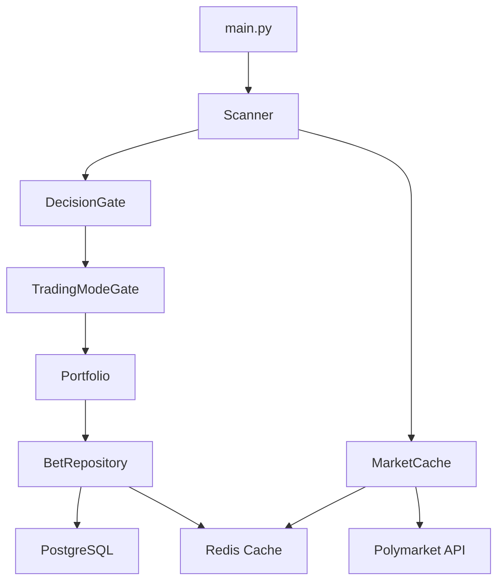

# Persistence & Trading Mode Design

**Spec**: `.opencode/plans/spec.md`  
**Status**: Draft

---

## Architecture Overview

We introduce a layered architecture: **Repository Pattern** for persistence abstraction, **Cache Layer** for performance, and **Trading Mode Gate** for operational safety.



---

## Code Reuse Analysis

### Existing Components to Leverage

| Component | Location | How to Use |
|-----------|----------|------------|
| `PaperBet` dataclass | `portfolio.py` | Extend to `Bet` model, add `trading_mode` field |
| `PaperPortfolio` | `portfolio.py` | Refactor to use `BetRepository` instead of CSV |
| `Settings` (Pydantic) | `config.py` | Add `database_url`, `redis_url`, `trading_mode` fields |
| `get_settings()` | `config.py` | Singleton pattern — reuse for DB/Redis config |

### Integration Points

| System | Integration Method |
|--------|-------------------|
| PostgreSQL | `asyncpg` or `psycopg2` via Repository pattern |
| Redis | `redis-py` with TTL-based caching |
| Existing CSV | One-time migration script |

---

## Components

### BetRepository

- **Purpose**: Abstract all database operations for bets (CRUD + query)
- **Location**: `db/repository.py`
- **Interfaces**:
  - `create_bet(bet: Bet) -> Bet` — insert new bet
  - `get_open_bets(trading_mode: Optional[str] = None) -> list[Bet]` — load unresolved bets
  - `get_bet_by_market_id(market_id: str) -> Optional[Bet]` — single bet lookup
  - `resolve_bet(market_id: str, won: bool) -> Bet` — mark bet resolved
  - `get_bet_history(filters: BetFilters) -> list[Bet]` — filtered query
- **Dependencies**: PostgreSQL connection pool, Redis client (optional)
- **Reuses**: Existing `PaperBet` fields and semantics

### MarketCache

- **Purpose**: Cache Polymarket API responses to reduce redundant calls
- **Location**: `cache/market_cache.py`
- **Interfaces**:
  - `get_market(market_id: str) -> Optional[Market]` — check cache first
  - `set_market(market_id: str, data: Market, ttl: int = 60)` — cache with TTL
  - `invalidate_market(market_id: str)` — clear specific entry
- **Dependencies**: Redis client
- **Reuses**: Existing `Market` dataclass from `client.py`

### TradingModeGate

- **Purpose**: Enforce trading mode decisions and prevent accidental live execution
- **Location**: `trading/mode_gate.py`
- **Interfaces**:
  - `get_current_mode() -> TradingMode` — read from env/settings
  - `is_live_enabled() -> bool` — safety check
  - `validate_bet_allowed() -> bool` — gate before bet creation
- **Dependencies**: `Settings`
- **Reuses**: Existing `paper_mode` flag in config (deprecated in favor of `TRADING_MODE`)

### MigrationScript

- **Purpose**: One-time CSV → PostgreSQL migration
- **Location**: `scripts/migrate_csv.py`
- **Interfaces**:
  - `run_migration(csv_path: str) -> MigrationResult` — idempotent migration
- **Dependencies**: `BetRepository`, existing CSV file
- **Reuses**: CSV parsing logic from `PaperPortfolio._load_csv()`

---

## Data Models

### Bet (SQLAlchemy / raw SQL)

```python
class Bet:
    id: int                    # auto-increment PK
    market_id: str             # Polymarket market identifier
    question: str              # Market question text
    outcome: str               # Selected outcome
    price: float               # Entry price (0-1)
    stake: float               # Amount wagered
    payout: float              # Potential payout
    kelly_frac: float          # Kelly fraction used
    edge: float                # Calculated edge at entry
    timestamp: datetime        # Bet creation time (UTC)
    probability_ai: float      # AI estimated probability
    analysis_summary: str      # AI reasoning text
    resolved: bool             # Has market resolved?
    result: str                # 'win' | 'lose' | null
    resolved_at: datetime      # Resolution timestamp
    trading_mode: str          # 'paper' | 'live'  ← NEW FIELD
    created_at: datetime       # DB insertion time
    updated_at: datetime       # Last update time
```

### PostgreSQL Schema

```sql
CREATE TYPE trading_mode AS ENUM ('paper', 'live');

CREATE TABLE bets (
    id              SERIAL PRIMARY KEY,
    market_id       VARCHAR(64) NOT NULL,
    question        TEXT NOT NULL,
    outcome         VARCHAR(255) NOT NULL,
    price           DECIMAL(10, 4) NOT NULL,
    stake           DECIMAL(12, 2) NOT NULL,
    payout          DECIMAL(12, 2) NOT NULL,
    kelly_frac      DECIMAL(5, 2) NOT NULL,
    edge            DECIMAL(10, 4) NOT NULL,
    timestamp       TIMESTAMPTZ NOT NULL,
    probability_ai  DECIMAL(10, 4),
    analysis_summary TEXT,
    resolved        BOOLEAN DEFAULT FALSE,
    result          VARCHAR(10),
    resolved_at     TIMESTAMPTZ,
    trading_mode    trading_mode NOT NULL DEFAULT 'paper',
    created_at      TIMESTAMPTZ DEFAULT NOW(),
    updated_at      TIMESTAMPTZ DEFAULT NOW()
);

-- Indexes for common query patterns
CREATE INDEX idx_bets_market_id ON bets(market_id);
CREATE INDEX idx_bets_trading_mode ON bets(trading_mode);
CREATE INDEX idx_bets_resolved ON bets(resolved);
CREATE INDEX idx_bets_timestamp ON bets(timestamp);
CREATE INDEX idx_bets_open ON bets(resolved, trading_mode) WHERE resolved = FALSE;
```

### Redis Key Schema

| Key Pattern | Value | TTL |
|-------------|-------|-----|
| `market:{market_id}` | JSON serialized Market | 60s |
| `bets:open:{mode}` | List of open bet IDs | 30s |
| `stats:{mode}` | Aggregated portfolio stats | 60s |

---

## Error Handling Strategy

| Error Scenario | Handling | User Impact |
|----------------|----------|-------------|
| PostgreSQL unreachable at startup | Exit with error code 1, log full connection string (masked password) | Bot does not start — safe fail |
| PostgreSQL transient error during operation | Retry 3x with exponential backoff, then raise | Alert via Telegram, bot pauses |
| Redis unavailable | Log warning, bypass cache, go direct to PostgreSQL | Slightly slower, fully functional |
| CSV migration duplicates | Skip duplicate, log warning | No data loss, idempotent |
| Invalid TRADING_MODE env var | Default to 'paper', log warning | Safe default |

---

## Tech Decisions

| Decision | Choice | Rationale |
|----------|--------|-----------|
| DB Driver | `psycopg2` (sync) | Project is currently sync; async adds complexity without need |
| ORM vs Raw SQL | Raw SQL with Repository pattern | Small schema, explicit control, no ORM overhead |
| Redis Client | `redis-py` | Standard, well-maintained, sync compatible |
| Cache Strategy | Cache-aside | Simple, matches current architecture |
| Migration | Python script (not Alembic) | Single table, simple schema — Alembic is overkill for now |
| Trading Mode Default | 'paper' | Safety first — live must be explicit |
| Existing CSV | Keep as backup, read-only after migration | Audit trail preservation |

---

## Environment Variables

| Variable | Default | Description |
|----------|---------|-------------|
| `DATABASE_URL` | — | PostgreSQL connection string (required) |
| `REDIS_URL` | — | Redis connection string (optional) |
| `TRADING_MODE` | `paper` | `paper` or `live` |
| `REDIS_TTL_SECONDS` | `60` | Default cache TTL |
